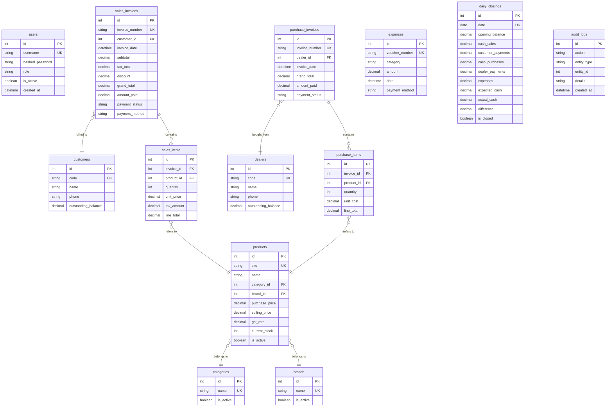

# Database Entity-Relationship (ER) Diagram

The PostgreSQL database leverages SQLAlchemy ORM with a strict relational model. Soft deletion (`is_active` flag) and timestamping (`created_at`, `updated_at`) are applied universally via a declarative abstract base class.

## Mermaid ER Diagram

## Architectural Notes
- **Transactions**: Sales and Purchases wrap multiple inserts (Invoice, Items, Inventory deduction, Ledger update) inside a single DB session to guarantee ACID compliance.
- **Constraints**: Deleting a `Customer` with linked `SalesInvoices` is prevented via Foreign Key constraints. Soft deletes must be used instead.
