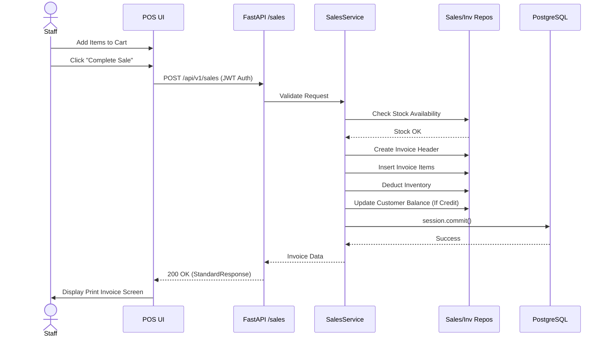
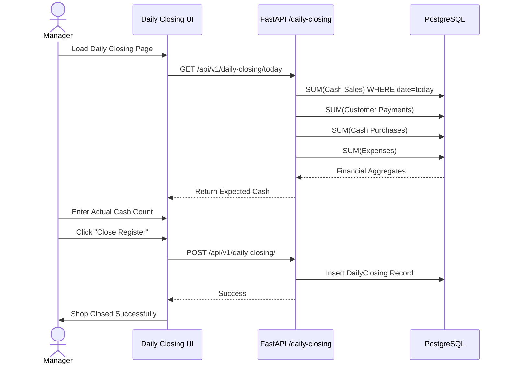
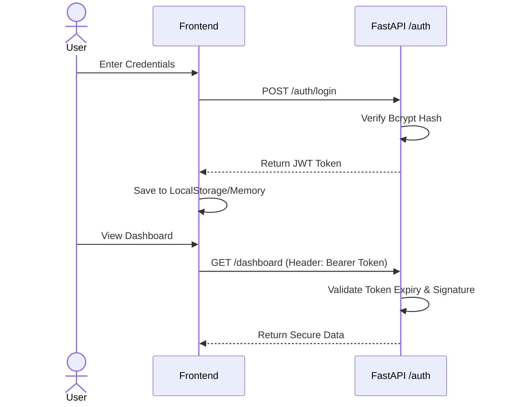

# Sequence Diagrams

These diagrams map the critical event flows within the system.

## 1. Point of Sale (POS) Workflow

```mermaid
sequenceDiagram
    actor Staff
    participant UI as POS UI
    participant API as FastAPI /sales
    participant Service as SalesService
    participant Repo as Sales/Inv Repos
    participant DB as PostgreSQL

    Staff->>UI: Add Items to Cart
    Staff->>UI: Click "Complete Sale"
    UI->>API: POST /api/v1/sales (JWT Auth)
    
    API->>Service: Validate Request
    Service->>Repo: Check Stock Availability
    Repo-->>Service: Stock OK
    
    Service->>Repo: Create Invoice Header
    Service->>Repo: Insert Invoice Items
    Service->>Repo: Deduct Inventory
    Service->>Repo: Update Customer Balance (If Credit)
    
    Service->>DB: session.commit()
    DB-->>Service: Success
    
    Service-->>API: Invoice Data
    API-->>UI: 200 OK (StandardResponse)
    UI->>Staff: Display Print Invoice Screen
```

## 2. Daily Closing Workflow

```mermaid
sequenceDiagram
    actor Manager
    participant UI as Daily Closing UI
    participant API as FastAPI /daily-closing
    participant DB as PostgreSQL

    Manager->>UI: Load Daily Closing Page
    UI->>API: GET /api/v1/daily-closing/today
    
    API->>DB: SUM(Cash Sales) WHERE date=today
    API->>DB: SUM(Customer Payments)
    API->>DB: SUM(Cash Purchases)
    API->>DB: SUM(Expenses)
    
    DB-->>API: Financial Aggregates
    API-->>UI: Return Expected Cash
    
    Manager->>UI: Enter Actual Cash Count
    Manager->>UI: Click "Close Register"
    UI->>API: POST /api/v1/daily-closing/
    API->>DB: Insert DailyClosing Record
    API-->>UI: Success
    UI->>Manager: Shop Closed Successfully
```

## 3. JWT Authentication Flow

```mermaid
sequenceDiagram
    actor User
    participant UI as Frontend
    participant API as FastAPI /auth
    
    User->>UI: Enter Credentials
    UI->>API: POST /auth/login
    API->>API: Verify Bcrypt Hash
    API-->>UI: Return JWT Token
    UI->>UI: Save to LocalStorage/Memory
    
    User->>UI: View Dashboard
    UI->>API: GET /dashboard (Header: Bearer Token)
    API->>API: Validate Token Expiry & Signature
    API-->>UI: Return Secure Data
```
