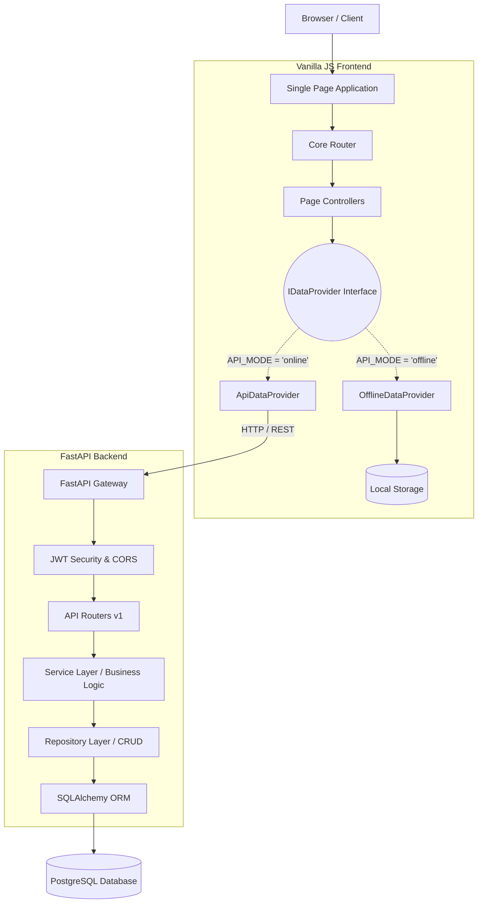

# System Architecture

The Senthil Enterprises ERP relies on a modular, dual-mode architecture that completely decouples the frontend business logic from the storage layer.

## Overall System Architecture

## Request Lifecycle (Backend)

1. **Request**: HTTP POST to `/api/v1/sales/`
2. **Middleware**: CORS validated.
3. **Security Guard**: `Depends(get_current_active_user)` verifies JWT.
4. **Router Validation**: Pydantic validates `InvoiceCreate` schema.
5. **Service Layer**: `SalesService.create_invoice()` evaluates business rules (e.g., check stock levels).
6. **Repository Layer**: `sales_repo.create()` and `inventory_repo.update()` execute within a single DB transaction.
7. **Commit/Rollback**: Transaction committed. If error occurs, rolled back safely.
8. **Response**: Standardized `StandardResponse` JSON format returned.
